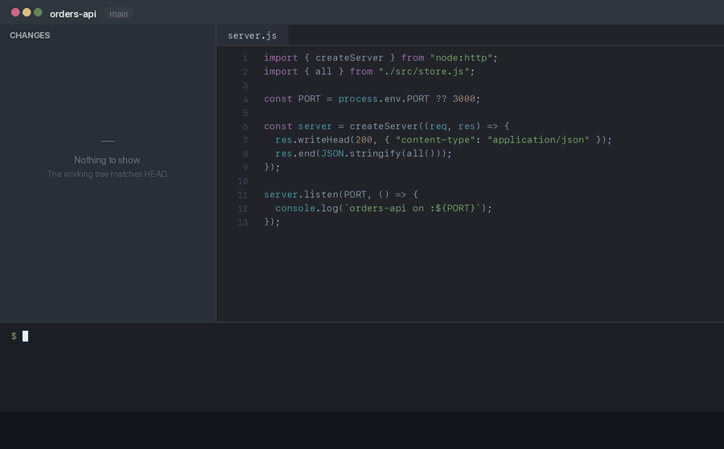

<h1 align="center">git-livedemo</h1>

<p align="center">
  <em>Step through a live coding demo one commit at a time —<br>
  and let your IDE show every step as a reviewable diff.</em>
</p>

<p align="center">
  <a href="https://github.com/vspiewak/git-livedemo/actions/workflows/test.yml"></a>
  <a href="LICENSE"></a>
  
  
</p>

---

<p align="center">
  
</p>

You are presenting. You built the project up as a clean chain of commits, and you want to
walk the room through it — one commit per slide, the diff on screen, the code running at
every stop.

So you `git checkout` the next commit. The files are right, and **the Changes view is
empty.** There is nothing to point at. You end up flipping to the git log and scrolling a
patch, which is not a demo.

`git-livedemo` fixes that. It puts step N into your working tree **and the index** while
`HEAD` stays on step N-1, so each step lands in the IDE as pending changes — added files,
added lines, ready to walk through.

```console
$ git livedemo next
Playing on 'livedemo' (you were on main).
  'git livedemo exit' puts you back on main.
Step 1/7 - Add the project skeleton
  9 files changed, 598 insertions(+)

$ git livedemo next
Step 2/7 - Add the HTTP endpoint
  3 files changed, 87 insertions(+), 2 deletions(-)
```

## Install

```bash
curl -fsSL https://raw.githubusercontent.com/vspiewak/git-livedemo/main/install.sh | sh
```

One file lands in `~/.local/bin/git-livedemo`, and git picks it up as a subcommand. No
runtime, no config file, no directory added to your project. To uninstall, delete it.

<details>
<summary><strong>Does this modify my git installation?</strong></summary>

No. Nothing is written into git, anywhere.

Git has no plugin registry. When it meets a subcommand it does not recognise, it scans
your `PATH` for an executable called `git-<name>` and runs it — that is the entire
mechanism, and it is how `git lfs` and `git absorb` work too. Your git install
(`git --exec-path`) is never touched.

So `git-livedemo` is one ordinary script in your own bin directory. Read it before you
run it; it is a single file. Deleting it is a complete uninstall, and git is exactly as
it was.
</details>

<details>
<summary>Other ways</summary>

```bash
# a specific directory
GIT_LIVEDEMO_PREFIX=/usr/local/bin curl -fsSL https://raw.githubusercontent.com/vspiewak/git-livedemo/main/install.sh | sh

# from a clone
git clone https://github.com/vspiewak/git-livedemo && cd git-livedemo && ./install.sh

# or just copy the script anywhere on your PATH — that is the whole program
```
</details>

## Use it

Build your demo the way you always would: a branch, one commit per step, oldest first.
Then point at it and go.

```bash
git livedemo use main     # your commits are the steps
git livedemo reset        # empty working tree — the "before" shot
git livedemo next         # step 1 appears in the IDE as pending changes
git livedemo next         # step 2 …
git livedemo exit         # back to the branch you came from
```

Presenting is smoother with a one-key alias:

```bash
alias next='git livedemo next'
```

## Commands

| | |
|---|---|
| `git livedemo use <branch>` | take the steps from a branch you committed yourself |
| `git livedemo next` / `prev` | move one step |
| `git livedemo goto <n>` | jump to a step; `0` is an empty working tree |
| `git livedemo reset` | back to step 0 |
| `git livedemo list` | every step, with `->` on the current one |
| `git livedemo status` | where you are |
| `git livedemo record "<msg>"` | append the working tree as a new step |
| `git livedemo exit` | stop playing, back to your branch |

Nothing takes a commit hash. You move by step number, or just keep typing `next`.

## How it works

A step is an ordinary commit. Playing step N does three things:

1. points `HEAD` at step N-1, on a playback branch of its own;
2. `git read-tree -u --reset` step N's tree into the index and working tree;
3. leaves it there.

The gap between `HEAD` and the index **is** the step, which is exactly what the IDE
renders. `git status` agrees:

```console
$ git livedemo goto 3 && git status --short
A  src/main/java/com/example/Controller.java
M  pom.xml
```

Step 1 has no previous step, so `HEAD` is left unborn and the whole tree reads as added.
Build tooling that insists on resolving `HEAD` (some versioning plugins) will not run at
step 1 for that reason; every later step has a real commit behind it.

## It will not eat your work

Playing rewrites the branch `HEAD` points at, so playback runs on its own `livedemo`
branch and never touches yours. On top of that, it refuses rather than destroy:

| situation | what happens |
|---|---|
| uncommitted changes to tracked files | refuses, tells you to commit or stash |
| an untracked file the step would overwrite | refuses, names the file — on every step, not just the first |
| an untracked file the step does not touch | left alone — `target/`, `.idea/`, scratch notes all survive |
| step 0, which empties the working tree | your `.gitignore` files stay put, so ignored build output stays ignored |
| the playback branch holds a commit that is not a step | refuses rather than rewind it |

Editing a tracked file mid-demo is discarded by the next step. That is deliberate: a
mistyped live edit cannot derail the rest of the talk.

Started from a detached `HEAD`? `exit` puts you back on that commit, not on `main`.

State lives in `.git/livedemo/`, so there is nothing to add to `.gitignore` and nothing
you can accidentally commit.

## Authoring steps

Already committed the demo up? `git livedemo use main` and you are done — a new commit on
that branch is a new step, automatically.

Prefer to grow it as you go? Build the change in the working tree and append it. It
lands on the steps branch — `steps` by default, or whichever branch you last passed to
`use`; the confirmation line names it:

```bash
git livedemo record "Step 3: wire the database"
```

Recording mid-playback is refused: the working tree holds a replayed step then, not new
work, and step 0 holds nothing at all.

Either way, **keep every step green**. Run your build before recording or committing a
step; one that does not compile is a step you cannot demo.

## Configuration

| variable | default | |
|---|---|---|
| `GIT_LIVEDEMO_PLAY_BRANCH` | `livedemo` | branch playback runs on |
| `GIT_LIVEDEMO_STEPS_REF` | `steps` | steps branch, overriding `use` for one command |
| `GIT_LIVEDEMO_PREFIX` | `~/.local/bin` | install directory |
| `NO_COLOR` | unset | any value turns colour off; it is off anyway when output is not a terminal |

## Tests

```bash
./test/test.sh
```

62 assertions over real repositories: diff shapes, every guard, an ignored build
directory, quoted and space-edged filenames, symlinks, two steps sharing a tree, a
detached `HEAD`, and a repository with no commits at all.

## License

MIT © Vincent Spiewak
